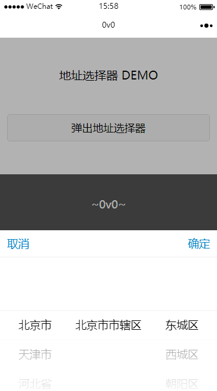
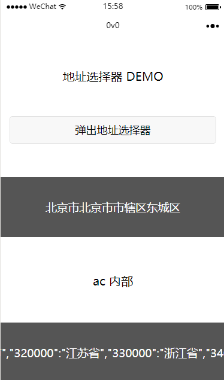

# wx-area-chooser 
微信小程序通用地址选择器组件

# 。。。。 

之前来 Github 找过有没有插件式的小程序用的地址选择器 结果没找到有。。。 都是些 DEMO 性质的，代码耦合地太厉害，我根本不能抄，然后自己去写了 


# 这是一个通用的组件 

这不是 demo 。。。 而且 刚刚够用。。。 


# 如何使用 

## 第一步 复制

把 `/src/component/areaChooser` 拷贝到你的小程序工程目录里面 

## 第二步 引入CSS

在你要使用地址选择器的页面的 `.wxss` 里面写上： 

``` css
@import "/path/to/areaChooser/areaChooser.wxss";
```

注意路径

## 第三步 引入控制器

在你要使用地址选择器的页面的 `.js` 里的 `onLoad` 写上： 

``` js
// 别忘了在顶部导入地址选择器核心 注意路径
import AC from '/path/to/areaChooser/areaChooser';

Page({
    data: {
        // 这一行不要漏 
        ac: null
    },
    onLoad: function () {
        // 然后 onload 里面 new 一下 
        let ac = new AC(this);
    },
});
```

## 第四步 引入模版

在你要使用地址选择器的页面的 `.wxml` 里写上： 

``` html
<!-- 注意路径 -->
<import src="/path/to/areaChooser/areaChooser.wxml" />
<template is="areaChooser" data="{{ ac }}"></template>

<!-- acPresent 由 areaChooser 自动创建 -->
<button bindtap="acPresent">点击弹出地址选择器</button>

<!-- 结果 -->
<view>{{ ac.val }}</view>
```


# 事件和注意事项 

你应该在你自己页面的 js 文件实现下面这个函数来响应 `地址完成事件` 

``` js
import AC from '/path/to/areaChooser/areaChooser';

Page({
    data: {
        ac: null
    },
    onLoad: function () {
        let ac = new AC(this);
    },
    /**
     * 地址选择器回调
     * 当地址选择器完成选择的时候将会执行这个函数
     * 详细地址是他的参数 selected
     */
    acOnConfirm: function(selected){
        console.log('[ 确认选择 ]', selected);
    }
});
```

# DEMO & PICTURE 

文件夹 src 就是 demo ... 可以打开微信的开发者工具查看。 





# LICENSE

MIT

